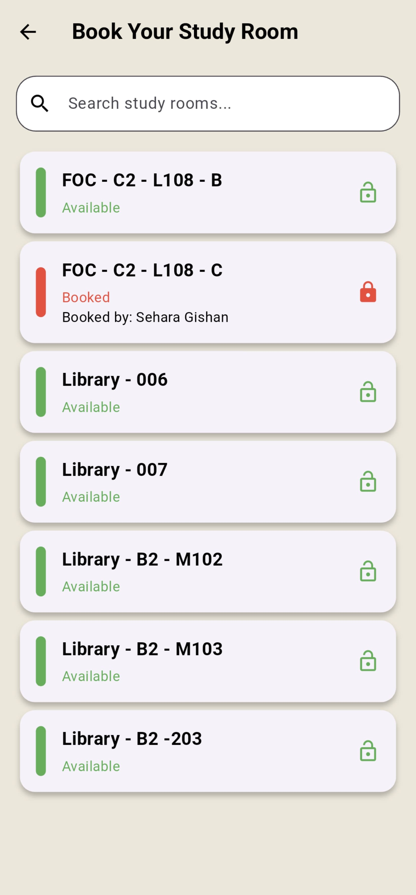
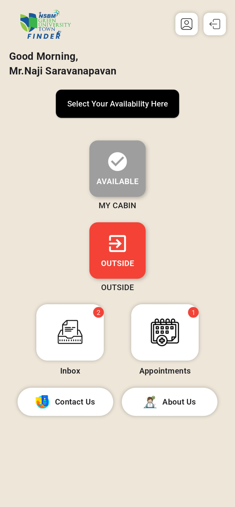
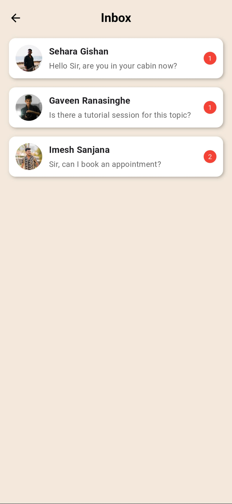
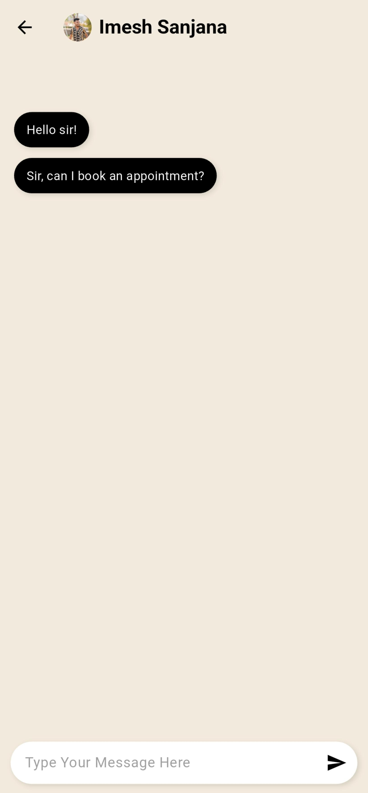
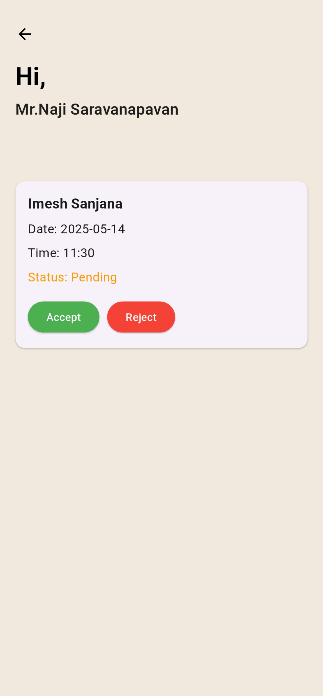
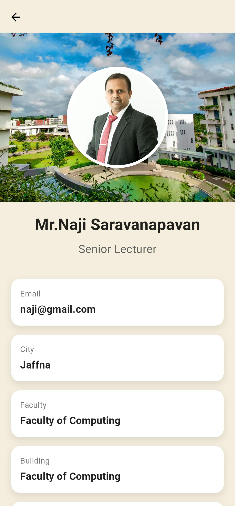
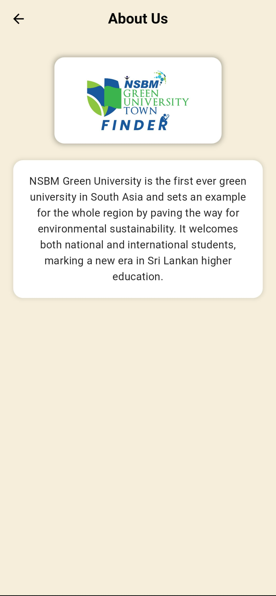
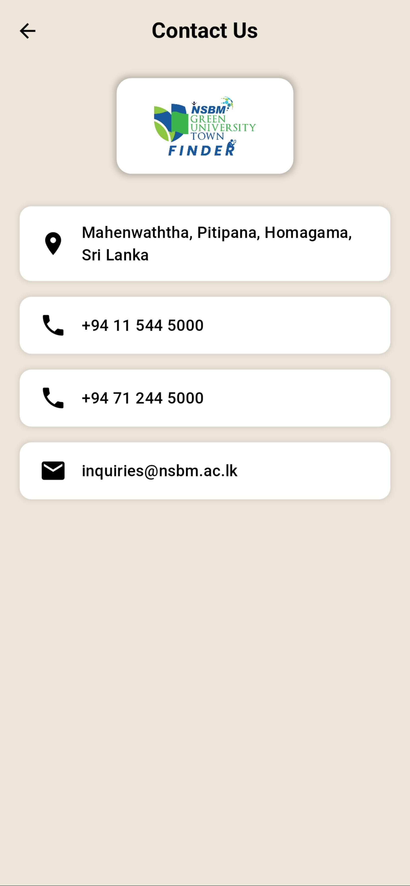

# 🏫 NSBM Finder Mobile Application

 <!-- Replace with your banner image -->

A Flutter-based mobile application designed to enhance the campus experience at NSBM Green University by simplifying navigation, communication, and resource booking for both students and lecturers.

## ✨ Key Features

### 👨‍🎓 For Students
- 🔍 Find lecturer cabins with interactive maps
- 📅 Book appointments with lecturers
- 🗣️ Real-time chat with lecturers
- 🏫 Reserve study rooms
- 🔔 Get important notifications

### 👨‍🏫 For Lecturers
- 📅 Manage appointment schedules
- 💬 Communicate with students
- 🚪 Update cabin location/availability
- ✅ Approve/reject room bookings
- 🔔 Notification system

## 📱 Screenshots

### 👨‍🎓 Student View

<div align="center">
  <div>
    
    <p><b>Student Login</b><br>Secure authentication with NSBM credentials</p>
  </div>
  
  <div>
    
    <p><b>Student Dashboard</b><br>Quick access to all student features</p>
  </div>
  
  <div>
    
    <p><b>Lecturer List</b><br>Select & Search Lecturers</p>
  </div>
  
  <div>
    
    <p><b>Lecturer Profile</b><br>To view Lecturer's details and availability</p>
  </div>

  <div>
    
    <p><b>Student Chat Screen</b><br>To chat with lecturers</p>
  </div>

<div>
    
    <p><b>Lecturer Cabin Location</b><br>To view Lecturer's cabin location</p>
  </div>

<div>
    
    <p><b>Study Rooms List</b><br>To view & search study rooms</p>
  </div>

<div>
    
    <p><b>Study Room's Details</b><br>To view study room's details</p>
  </div>

<div>
    
    <p><b>Study Room's Booked Screen</b><br>To view booked study room's details</p>
  </div>

<div>
    
    <p><b>Student Profile</b><br>To view student's details</p>
  </div>
</div>

### 👨‍🏫 Lecturer View

<div align="center">
  <div>
    
    <p><b>Lecturer Dashboard</b><br>Quick access to all lecturer features</p>
  </div>
  
  <div>
    
    <p><b>Lecturer Inbox</b><br>To view received messages</p>
  </div>
  
  <div>
    
    <p><b>Lecturer Chat Screen</b><br>To reply for messages</p>
  </div>
  
  <div>
    
    <p><b>Lecturer's Appointments</b><br>To check appointments</p>
  </div>
  
  <div>
    
    <p><b>Lecturer's Profile</b><br>To view lecturer details</p>
  </div>

  <div>
    
    <p><b>About Us</b><br>University Description</p>
  </div>

  <div>
    
    <p><b>Contact Us</b><br>University contact details</p>
  </div>
</div>

## 🛠️ Tech Stack

**Frontend:**
- Flutter (Dart)
- Responsive UI Design

**Backend:**
- Firebase Firestore (Database)
- Firebase Authentication
- Cloud Functions (JavaScript)

**Additional:**
- Push Notifications (FCM)
- Google Maps API
- Calendar Integration

## 🚀 Getting Started

### Prerequisites
- Flutter SDK (>=3.0.0)
- Dart (>=2.17.0)
- Firebase account

### Installation
1. Clone the repository
   ```sh
   git clone https://github.com/yourusername/nsbm-campus-companion.git
